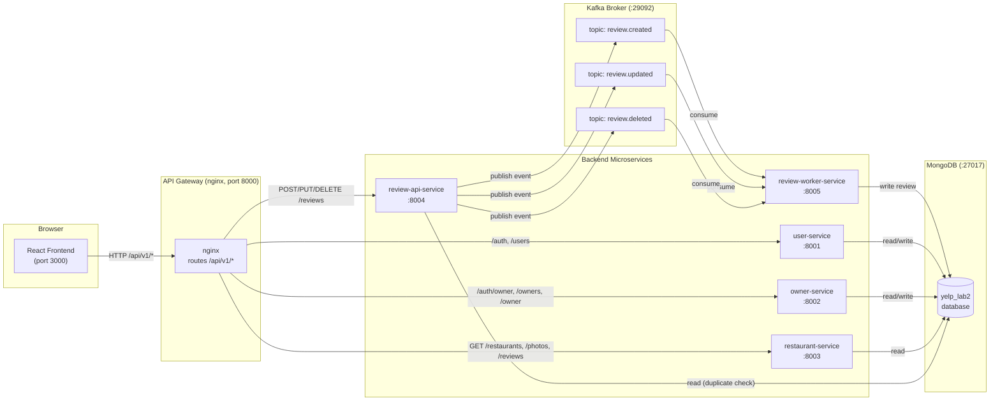

# Phase 4 — Kafka Review Flow Architecture

## Data Flow Diagram



## Component Responsibilities

| Component | Role | Kafka Role |
|---|---|---|
| `react frontend` | User-facing SPA; calls REST APIs via gateway | — |
| `nginx api-gateway` | Routes `/api/v1/*` to the right microservice | — |
| `user-service` | Auth, profile, favorites, history | — |
| `owner-service` | Owner auth, dashboard, restaurant claim | — |
| `restaurant-service` | Restaurant CRUD, photo listing, review reads (GET) | — |
| `review-api-service` | Review writes (POST/PUT/DELETE); validates auth & payload | **Producer** |
| `review-worker-service` | Background daemon; processes review events from Kafka | **Consumer** |
| `kafka` | Message broker — decouples write acceptance from persistence | Broker |
| `mongodb` | Persistent storage for all domain data | — |

## Review Write Flow (Step by Step)

```
1. User submits/edits/deletes a review in the browser
2. React calls POST/PUT/DELETE /api/v1/reviews/* via axios
3. nginx gateway routes the request to review-api-service:8004
4. review-api-service:
      a. validates JWT token
      b. checks restaurant exists (404 if not)
      c. checks for duplicate review (409 if already reviewed)
      d. assigns a review_id (MongoDB counter)
      e. publishes event to Kafka topic (review.created / review.updated / review.deleted)
      f. returns HTTP 202 { status: "queued", review_id, event_id }
5. review-worker-service (background thread, always running):
      a. KafkaConsumer polls all three topics
      b. deserializes JSON payload
      c. calls processor.process_review_event(topic, payload)
      d. processor dispatches to repository (create / update / delete)
      e. repository writes/updates/deletes document in MongoDB reviews collection
6. Next GET /restaurants/{id}/reviews (routed to restaurant-service) reads the
   persisted review from MongoDB and returns it to the frontend
```

## Infrastructure Layout

```
Host machine
├── port 3000  → frontend (nginx serving React SPA)
├── port 8000  → api-gateway (nginx reverse proxy)
├── port 9092  → kafka (host-accessible listener)
└── port 27017 → mongodb

Docker internal network (backend bridge)
├── user-service:8001
├── owner-service:8002
├── restaurant-service:8003
├── review-api-service:8004
├── review-worker-service:8005
├── kafka:29092
├── zookeeper:2181
└── mongodb:27017
```
